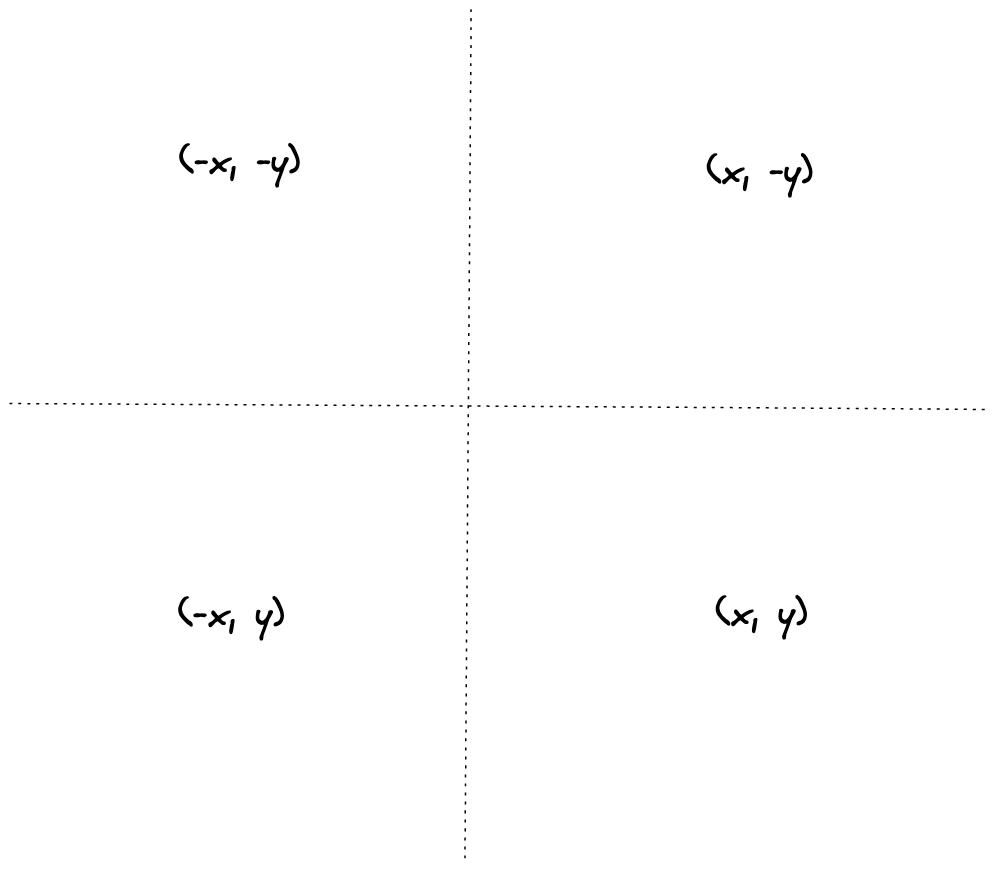
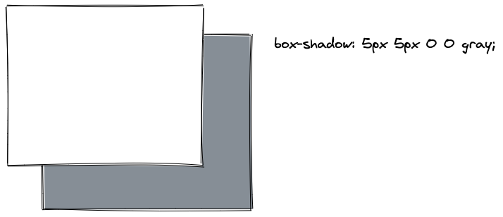
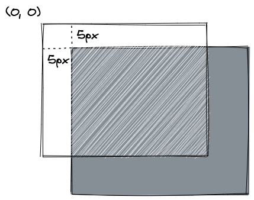
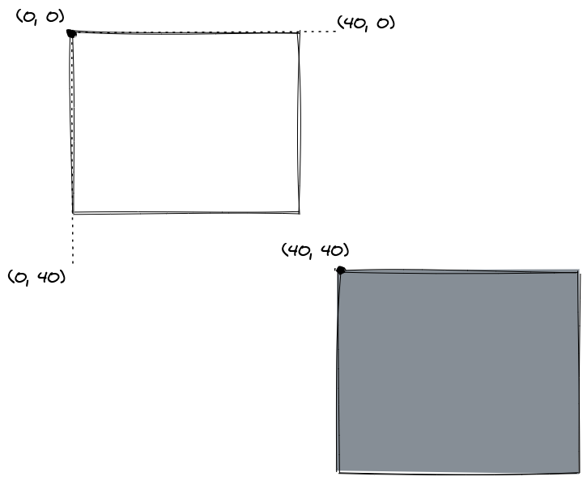
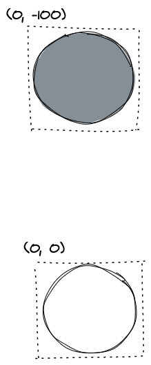
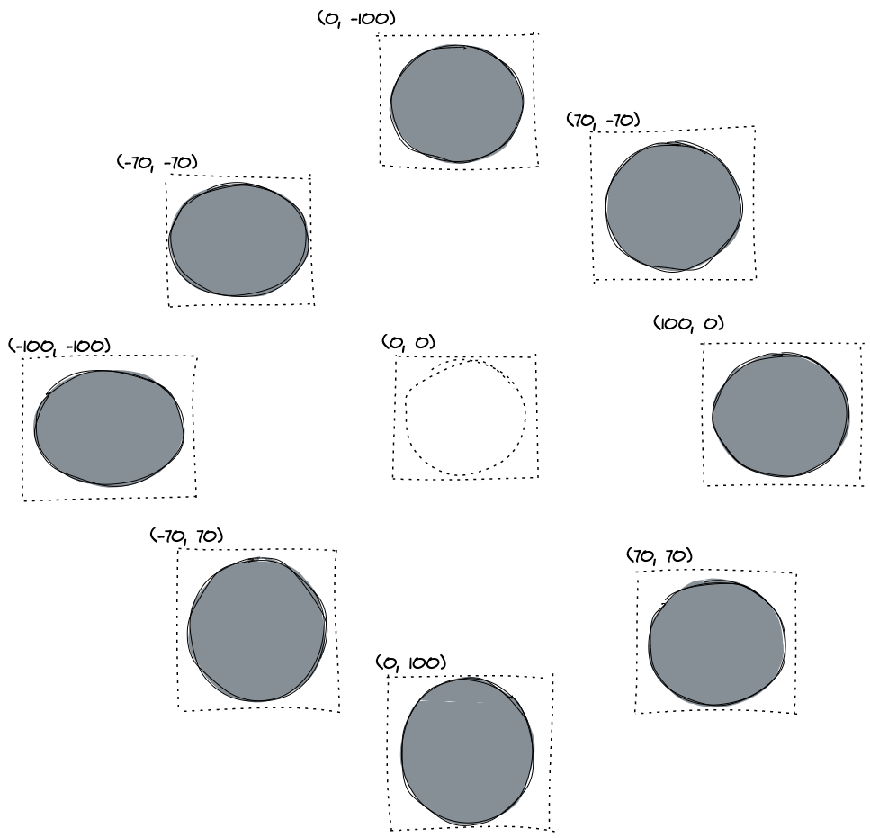
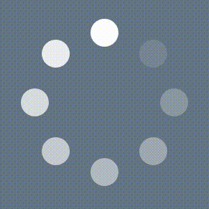

Ah, loading spinners. They're fun visual CSS projects. Seemingly confusing to create, the trick is actually quite simple. And once you've made one, there are so many variations to it.

So this trick consists of these simple steps:

1. creating a circular div
2. adding a box shadow
3. positioning the box shadow
4. positioning 7 more box shadows
5. animation!

Let's sketch out how box shadow works. But first, let's look at how axes work in CSS.

In a Caresian coordinate system, positive x and y coordinates are in the top-right quadrant.

Conversely, with CSS, positive x & y values are found in the bottom right. It's essentially an upside down Cartesian axis.



Now when using the box-shadow CSS property, the first two values are the x and y coordinates (horizontal & vertical offsets). So adding `5px` and `5px` will look something like this:



If the top div was translucent, it would like so:



But if you wanted to move the box shadow much further away, you'd have to add x and y coordinates greater than the width and height of the origin element, like so:



So how would would we accomplish this with circular divs? Easy! Same as with a square.



The cool thing about box shadow, is that you can have multiple shadows. Following the above example, if we wanted 8 total box shadows on our, it's just a matter of finding the appropriate x and y coordinates for each one.



Now let's get started with our animation!

To begin, we need the starting div, from which all of the box shadows will, uh... shadow. I'm giving it a `height` and `width` of `40px`, and because it has no background color or border, it'll be inivisble. Also be sure to give it a `border-radius: 50%` to make sure the box shadows are circular.

```
.dot-spinner {
	border-radius: 50%;
	height: 40px;
	width: 40px;
}
```

Next, we need 8 total colors, representing different shades of gray for each one of our box shadows. Rather than rewriting this for every box-shadow, I accomplished this by simply creating CSS variables of different colors. The main color is white and the 7 colors are white with opacities set at increments of `0.125`, represent the gradation of grays.

```
:root {
	--white: rgba(255, 255, 255, 1);
	--gray1: rgba(255, 255, 255, 0.125);
	--gray2: rgba(255, 255, 255, 0.25);
	--gray3: rgba(255, 255, 255, 0.375);
	--gray4: rgba(255, 255, 255, 0.5);
	--gray5: rgba(255, 255, 255, 0.625);
	--gray6: rgba(255, 255, 255, 0.75);
	--gray7: rgba(255, 255, 255, 0.875);
}
```

Keyframes animations work with different states of the animation. To accomplish our goal, we need one state for each box shadow. So our 8 states can cleanly be split up as: 0%, 12.5%, 25%, 37.5%, 50%, 62.5%, 87.5%, and 100%.

Beginning with the first state of 0% and final state of 100% (to represent a full loop), we can add a `box-shadow` like so:

```
@keyframes spin-circle {
	0%,
	100% {
		box-shadow: 0 -100px 0 0 var(--white);
	}
}
```

This represents the first box shadow, which'll be a white circle `100px` north of the original div. Now we want to create 7 more box shadows for this state, each representing a more opaque gradation of the original white. Each circle will be given different x,y coordinates to orbit around the original div.

```
@keyframes spin-circle {
	0%,
	100% {
		box-shadow: 
			0 -100px 0 0 var(--white),
			70px -70px 0 0 var(--gray1),
			100px 0 0 0 var(--gray2), 
			70px 70px 0 0 var(--gray3),
			0px 100px 0 0 var(--gray4),
			-70px 70px 0 0 var(--gray5),
			-100px 0 0 0 var(--gray6),
			-70px -70px 0 0 var(--gray7);
	}
}
```

And now we create the multiple states, but with the colors shifted up for each state.

```
@keyframes spin-circle {
	0%,
	100% {
		box-shadow:
			0 -100px 0 0 var(--white),
			70px -70px 0 0 var(--gray1),
			100px 0 0 0 var(--gray2), 
			70px 70px 0 0 var(--gray3),
			0px 100px 0 0 var(--gray4),
			-70px 70px 0 0 var(--gray5),
			-100px 0 0 0 var(--gray6),
			-70px -70px 0 0 var(--gray7);
	}
	
	12.5% {
		box-shadow:
			0 -100px 0 0 var(--gray7),
			70px -70px 0 0 var(--white),
			100px 0 0 0 var(--gray1),
			70px 70px 0 0 var(--gray2),
			0px 100px 0 0 var(--gray3),
			-70px 70px 0 0 var(--gray4),
			-100px 0 0 0 var(--gray5),
			-70px -70px 0 0 var(--gray6);
	}

	25% {
		box-shadow:
			0 -100px 0 0 var(--gray6),
			70px -70px 0 0 var(--gray7),
			100px 0 0 0 var(--white),
			70px 70px 0 0 var(--gray1),
			0px 100px 0 0 var(--gray2),
			-70px 70px 0 0 var(--gray3),
			-100px 0 0 0 var(--gray4),
			-70px -70px 0 0 var(--gray5);
	}
	
	37.5% {
		box-shadow:
			0 -100px 0 0 var(--gray5),
			70px -70px 0 0 var(--gray6),
			100px 0 0 0 var(--gray7),
			70px 70px 0 0 var(--white),
			0px 100px 0 0 var(--gray1),
			-70px 70px 0 0 var(--gray2),
			-100px 0 0 0 var(--gray3),
			-70px -70px 0 0 var(--gray4);
	}

	50% {
		box-shadow:
			0 -100px 0 0 var(--gray4),
			70px -70px 0 0 var(--gray5),
			100px 0 0 0 var(--gray6),
			70px 70px 0 0 var(--gray7),
			0px 100px 0 0 var(--white),
			-70px 70px 0 0 var(--gray1),
			-100px 0 0 0 var(--gray2),
			-70px -70px 0 0 var(--gray3);
	}
	
	62.5% {
		box-shadow:
			0 -100px 0 0 var(--gray3),
			70px -70px 0 0 var(--gray4),
			100px 0 0 0 var(--gray5),
			70px 70px 0 0 var(--gray6),
			0px 100px 0 0 var(--gray7),
			-70px 70px 0 0 var(--white),
			-100px 0 0 0 var(--gray1),
			-70px -70px 0 0 var(--gray2);
	}

	75% {
		box-shadow:
			0 -100px 0 0 var(--gray2),
			70px -70px 0 0 var(--gray3),
			100px 0 0 0 var(--gray4),
			70px 70px 0 0 var(--gray5),
			0px 100px 0 0 var(--gray6),
			-70px 70px 0 0 var(--gray7),
			-100px 0 0 0 var(--white),
			-70px -70px 0 0 var(--gray1);
	}
	
	87.5% {
		box-shadow:
			0 -100px 0 0 var(--gray1),
			70px -70px 0 0 var(--gray2),
			100px 0 0 0 var(--gray3),
			70px 70px 0 0 var(--gray4),
			0px 100px 0 0 var(--gray5),
			-70px 70px 0 0 var(--gray6),
			-100px 0 0 0 var(--gray7),
			-70px -70px 0 0 var(--white);
	}
}
```

Add the animation to our div, and voila, we have a spinning spinner.



[Here's a Fiddle with this example!](https://jsfiddle.net/nlemast/zrmevyug/23/)